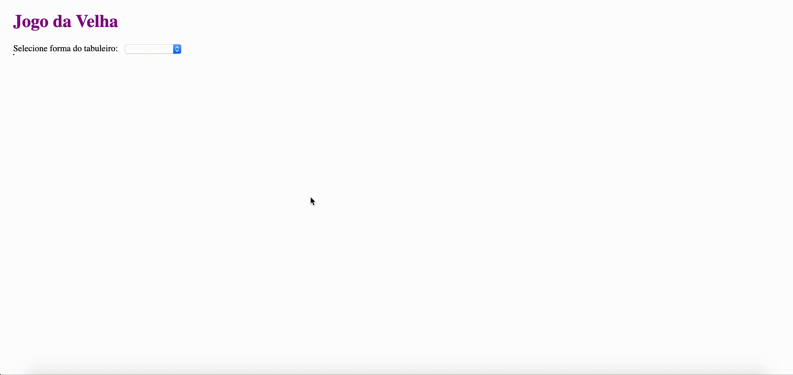

# Jogo da Velha

Para rodar o projeto na sua máquina, você precisa ter instalado o [NodeJS](https://nodejs.org/en/).

Após instalado, basta rodar:

```shell
npm install -g gatsby-cli
npm run start
```

Visualização do App



## Para buildar arquivos html, css e js

```shell
npm run build
```
